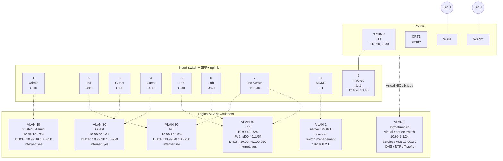

# nifty-filter

A declarative NixOS router distribution. Define your entire network
in a single HCL config file (VLANs, firewall rules, DHCP, DNS, QoS,
and infrastructure services) and deploy immutable VM images to Proxmox
VE.

The root filesystem is read-only. All configuration lives on a
writable `/var` partition. Upgrades replace the entire system image
while preserving state.

> nifty-filter is in active development and should be used for research
> purposes only. Use it at your own risk.

## Prerequisites

 * You need a workstation (Linux/macOS) to build images.
 * You need a dedicated router machine running Proxmox VE.

### Workstation

 * Clone this repo.
 * Install [Nix](https://nixos.org/download/) and [just](https://github.com/casey/just).
 * Ensure your ssh-agent is running and that `ssh-add -L` returns at least one loaded key. All agent keys are installed on the VMs during creation.
 * Ensure you can login to your PVE host as root via SSH.

### Proxmox VE Host

Install [Proxmox VE](https://www.proxmox.com/en/proxmox-virtual-environment/overview)
on a dedicated router machine. During the installer you must assign a
network interface to `vmbr0` (the management bridge). We recommend
using an **external USB network adapter** for this so that all onboard
NICs remain available for PCI passthrough to the router VM. This lets
you isolate PVE from the network by unplugging the USB NIC. Later on,
you can add a route to PVE from your trusted VLAN, but the USB NIC
adds an emergency fallback.

The USB NIC does not need normal internet access — it only needs a
direct link to your workstation for SSH administration. Connect it
directly to your workstation (or through a small unmanaged switch) and
assign a static IP on both ends. From there, an SSH SOCKS proxy
through the workstation provides outbound access for Debian package
upgrades on the PVE host:

```bash
# On the workstation, start a SOCKS proxy:
ssh -D 1080 root@<pve-ip>

# On the PVE host, use the proxy for apt:
echo 'Acquire::http::Proxy "socks5h://127.0.0.1:1080";' > /etc/apt/apt.conf.d/99proxy
apt update && apt full-upgrade
```

This keeps every onboard NIC free for passthrough while still allowing
you to manage and update the PVE host over the direct USB link.

## Example network

The layers of the network are: 

 - A direct USB link for PVE administration from your workstation.
 - A virtual management bridge for the PVE host to talk to the router VM.
 - The VLANs defined by the router that carry production traffic on the managed switch.

The rest of this document uses the
[`examples/vlan_router.hcl`](examples/vlan_router.hcl) config as a
running example.



#### Management interfaces

| Network           | Subnet             | Purpose                                                                                                                               |
|-------------------|--------------------|---------------------------------------------------------------------------------------------------------------------------------------|
| PVE management    | `192.168.100.0/24` | Direct USB NIC link between workstation (`192.168.100.1`) and PVE host (`192.168.100.2`). SSH administration and SOCKS proxy for apt. |
| Router management | `10.99.0.0/24`     | Virtual bridge (`vmbr1`) between PVE and the router VM. Out-of-band access to the router from the Proxmox host.                       |

#### VLANs

| VLAN    | ID | Subnet                           | Purpose                                                                                                                             |
|---------|----|----------------------------------|-------------------------------------------------------------------------------------------------------------------------------------|
| infra   | 2  | `10.99.2.0/24`                   | Infrastructure services (Step-CA, Traefik, DNS, NTP). Uses a dedicated virtual NIC on an isolated bridge — not on the trunk/switch. |
| trusted | 10 | `10.99.10.0/24`                  | Trusted devices. Full internet, SSH to router, dashboard access. mDNS reflected to IoT.                                             |
| iot     | 20 | `10.99.20.0/24`                  | IoT jail. DHCP only, no internet, no router access beyond DHCP/DNS. mDNS reflected to trusted.                                      |
| guest   | 30 | `10.99.30.0/24`                  | Guest network. Internet access but no SSH or dashboard.                                                                             |
| lab     | 40 | `10.99.40.0/24` + `fd00:40::/64` | Lab (dual-stack). Full internet on IPv4 and IPv6, SSH to router.                                                                    |

## Deploying to Proxmox VE

A full deployment consists of three VMs, deployed in order.

| VM             | VMID | IP        | Purpose                                 |
|----------------|------|-----------|-----------------------------------------|
| infra-CA       | 100  | 10.99.2.3 | Step-CA private PKI (ACME + mTLS certs) |
| nifty-filter   | 101  | 10.99.0.1 | Router, firewall, dashboard             |
| infra-services | 202  | 10.99.2.2 | Traefik, Technitium DNS, DDNS, NTP      |

Splitting the infrastructure across separate VMs provides several
benefits: each VM can be upgraded and rebooted independently without
disrupting the others, smaller images build and boot faster, and
kernel-level isolation limits the blast radius if any single service is
compromised. Because these VMs communicate over the network, they need
a way to cryptographically verify each other's identity. Step-CA
provides a private certificate authority that issues TLS server
certificates (via ACME) and mTLS client certificates so that every
connection between VMs is authenticated. The CA runs on its own VM so
that its private keys are never co-located with application workloads.
With long-lived certificates, the CA VM can be shut down entirely
between renewals to further limit access to the CA.

The router uses PCI passthrough NICs for WAN, trunk, and management.
The infra VLAN uses a virtual NIC on an isolated bridge (`vmbr2`)
shared between the router and infrastructure VMs.

### 1. Test the PVE connection

All `pve-*` commands take an SSH host alias as the first argument. Add
an entry to your `~/.ssh/config`:

```
Host pve-router
    HostName 192.168.1.100   # your Proxmox host IP on the management interface (vmbr0)
    User root
```

Then verify the connection:

```bash
just pve-status pve-router
```

This prints the logged-in user, PVE version, uptime, and any existing
VMs.

### 2. Deploy Step-CA (infra-CA)

The CA VM deploys first — it has no external dependencies (the
container image is built by Nix, no registry pull needed).

```bash
just pve-install-step-ca pve-router 10.99.2.3
```

This creates the infra bridge (`vmbr2`), adds a NIC to the router VM
slot, and creates a minimal VM (1 CPU, 512 MB, 4 GB disk). On first
boot, Step-CA bootstraps automatically: generates a root CA, enables
ACME, and issues client certificates for dashboard, service-monitor,
and traefik.

### 3. Deploy the router

```bash
just pve-install pve-router
```

The wizard will prompt for:
- **VM ID** — defaults to the lowest unused ID (starting at 101)
- **VM name** — defaults to `nifty-filter`
- **WAN NIC** — choose virtual (bridge) or PCI passthrough
- **LAN NIC** — same choice
- **Additional NICs** — add as many as needed

For PCI passthrough, it lists all network PCI devices on the host. For
virtual NICs, it lists available bridges. Set `MGMT_SUBNET` to
override the management subnet (default: `10.99.0.0/24`).

A dedicated `mgmt` bridge is always created automatically for
out-of-band management (default subnet `10.99.0.0/24`). The VM gets
two disks: a boot+root disk (read-only NixOS system) and a `/var` disk
(writable config/state). It is created with q35/UEFI, 2 cores, 2 GB
RAM, and serial console (no VGA). Set `VAR_SIZE` to override the
default 8 GB `/var` disk.

### 4. Distribute certificates

With the router online as a jump host, distribute TLS certificates from
the Step-CA VM to all other VMs:

```bash
just pve-distribute-certs pve-router
```

This copies the dashboard client cert/key to the router, and (if the
infra-services VM is reachable) the service-monitor and traefik certs
too. The root CA cert is saved locally for inclusion in your Nix config.
Run it again after deploying infra-services to distribute those certs.

The router boots with ACME + mTLS enabled by default. Once the certs
are in place, the dashboard will obtain its server certificate from
Step-CA and require mTLS client certificates on all HTTPS endpoints.
If the dashboard is in a restart loop waiting for certs, it will pick
them up automatically.

### 5. Deploy infra-services

With the router online as a gateway, deploy the services VM:

```bash
just pve-install-services pve-router 10.99.2.2
```

This creates the infra-services VM (2 CPU, 2 GB, 8 GB disk) with
Traefik, Technitium DNS, DDNS updater, Chrony NTP, and the
service-monitor. Container images are pulled from the registry via the
router gateway.

### Upgrading

Rebuild and upgrade any VM in place (preserves `/var`):

```bash
just pve-upgrade-step-ca pve-router      # Upgrade Step-CA
just pve-upgrade pve-router              # Upgrade router
just pve-upgrade-services pve-router     # Upgrade infra-services
```

### Destroying VMs

```bash
just pve-destroy pve-router 100 infra-CA        # Step-CA
just pve-destroy pve-router 101 nifty-filter     # Router
just pve-destroy pve-router 202 infra-services   # Services
```

## Configuring the router

SSH into the installed system and edit the HCL config:

```bash
nano /var/nifty-filter/nifty-filter.hcl
```

Apply changes without rebooting:

```bash
sudo systemctl restart nifty-filter   # Firewall rules
sudo systemctl restart nifty-dnsmasq  # DHCP/DNS
```

## Upgrading

### From a workstation

```bash
just upgrade <router-ip>
```

Builds the system closure locally, rsyncs only the missing store paths
to the router over SSH, updates boot entries, and reboots.

### From the router

```bash
nifty-upgrade
```

Pulls the latest source from git, builds on the router, and reboots.

## Maintenance mode

```bash
nifty-maintenance
```

Reboots into a one-shot mode with the root filesystem mounted
read-write. The console auto-logs in with a red `[MAINTENANCE]`
prompt. Reboot again to return to normal read-only mode.

## System architecture

### Filesystem layout

| Mount   | Mode                  | Purpose                                         |
|---------|-----------------------|-------------------------------------------------|
| `/`     | read-only             | NixOS system, nifty-filter binary, all services |
| `/var`  | read-write            | Router config, DHCP leases, SSH keys, logs      |
| `/boot` | read-write            | EFI system partition, kernel, bootloader        |
| `/tmp`  | tmpfs                 | Scratch (cleared on reboot)                     |
| `/home` | bind from `/var/home` | User home directories                           |

### Boot services

| Service             | Purpose                                   | Config source      |
|---------------------|-------------------------------------------|--------------------|
| `nifty-link`        | Renames interfaces by MAC address         | `nifty-filter.hcl` |
| `nifty-hostname`    | Sets hostname                             | `nifty-filter.hcl` |
| `nifty-network`     | Configures WAN (DHCP) and LAN (static IP) | `nifty-filter.hcl` |
| `nifty-filter-init` | Seeds default config on first boot        | --                 |
| `nifty-filter`      | Generates and applies nftables rules      | `nifty-filter.hcl` |
| `nifty-dnsmasq`     | DHCP and DNS server                       | `nifty-filter.hcl` |

### Configuration files

All config lives in `/var/nifty-filter/`:

```
/var/nifty-filter/
  nifty-filter.hcl        # All router config (firewall, interfaces, DHCP, DNS)
  ssh/
    ssh_host_*            # Persistent SSH host keys
```

## Standalone nftables generator

The `nifty-filter` binary can also be used as a standalone nftables
rule generator, outside of NixOS. It reads an HCL config file and
emits a complete nftables ruleset.

```bash
cargo install nifty-filter
```

Or [download a release](https://github.com/EnigmaCurry/nifty-filter/releases).

```bash
# Generate rules from an HCL config file:
nifty-filter nftables --config router.hcl

# Generate and validate (requires nft on the host):
nifty-filter nftables --config router.hcl --validate

# Generate QoS (CAKE) traffic shaping commands:
nifty-filter qos --config router.hcl
```

See [examples/](examples/) for complete configurations.
